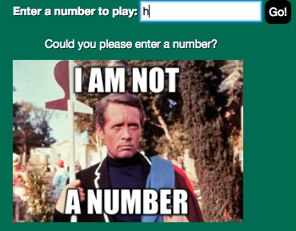

# _Ping Pong_

#### _Third Independent Project (JS) for Intro at Epicodus, 06.09.2017_

#### By _**Calla Rudolph (<callarudolph@gmail.com>)**_

## Description

_This project utilizes looping, arrays, and mapping to scan through an inputted number and return a counted list up to that inputted number. There are several specs included to determine when to replace part of the count with 'ping', 'pong', or 'ping-pong'. There are several picture results that will display depending on what the user inputs._

## Specifications

* It returns an error if something other than a number is inputted.
  * Example Input: $
  * Example Output: 'Please enter a number'
* It can count up to the provided number.
  * Example Input: 2
  * Example Output: [1, 2]
* It returns any number in the count that is divisible by 3 with 'ping'.
  * Example Input: 3
  * Example Output: [1, 2, ping]
* It returns any number in the count that is divisible by 5 with 'pong'.
  * Example Input: 5
  * Example Output: [1, 2, ping, 4, pong]
* It returns any number in the count that is divisible by 15 with 'ping-pong'.
  * Example Input: 15
  * Example Output: [1, 2, ping, 4, pong, ping, 7, 8, ping, pong, 11, ping, 13, 14, ping-pong]

## Setup/Installation Requirements

* Open GitHub site on your browser: https://github.com/CallaRudolph/pingpong
* Select the dropdown (green box) "Clone or download"
* Copy the link for the GitHub repository
* Open Terminal on your computer and perform the following steps:
  * `$ cd desktop`
  * `$ git clone <paste-repo-url>`
  * `$ cd pingpong `
  * `$ open index.html `
* Input a number (or any character) to see your result!

## Support and contact details

If you run into any findings, please email me at the address above!

## Technologies Used

* HTML
* CSS
* Bootstrap
* JavaScript
* jQuery

### License

_This software is licensed under the MIT license._

Copyright (c) 2017 **_Calla Rudolph_**
